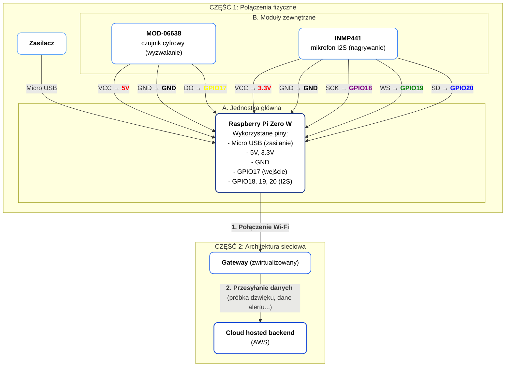

## 1. Lista co potrzebujemy

Z POZA LISTY:
- Nagrywanie próbek -> Moduł z mikrofonem MEMS INMP441: https://kamami.pl/moduly-z-mikrofonami-i-detektory-dzwieku/587534-modul-z-mikrofonem-mems-inmp441-5906623475483.html

Z LISTY:
- Wybudzanie -> Czujnik dźwięku cyfrowy 5V MOD-06638
- Rassberry Pi Zero W
- Zasilacz
	
DODATKOWE:
- Obudowa (pomysł: Marta drukarka 3D)
- ew. Antena do karty sieciowej

## 2. Schemat (mermaid.live):

```
graph TD
    %% ================================================================
    %% CZĘŚĆ 1: POŁĄCZENIA FIZYCZNE
    %% ================================================================
    subgraph "CZĘŚĆ 1: Połączenia fizyczne"
    
        subgraph "A. Jednostka główna"
            RPI["<b>Raspberry Pi Zero W</b><br><u>Wykorzystane piny:</u><br>- Micro USB (zasilanie)<br>- 5V, 3.3V<br>- GND<br>- GPIO17 (wejście)<br>- GPIO18, 19, 20 (I2S)"]
        end

        subgraph "B. Moduły zewnętrzne"
            MicDigital["<b>MOD-06638</b><br>czujnik cyfrowy (wyzwalanie)"]
            MicI2S["<b>INMP441</b><br>mikrofon I2S (nagrywanie)"]
        end
        
        Zasilacz["<b>Zasilacz</b>"] -- "Micro USB" --> RPI

        %% Połączenia (kable)
        MicDigital -- "VCC → <b><font color=red>5V</font></b>" --> RPI
        MicDigital -- "GND → <b><font color=black>GND</font></b>" --> RPI
        MicDigital -- "DO → <b><font color=yellow>GPIO17</font></b>" --> RPI

        MicI2S -- "VCC → <b><font color=red>3.3V</font></b>" --> RPI
        MicI2S -- "GND → <b><font color=black>GND</font></b>" --> RPI
        MicI2S -- "SCK → <b><font color=purple>GPIO18</font></b>" --> RPI
        MicI2S -- "WS → <b><font color=green>GPIO19</font></b>" --> RPI
        MicI2S -- "SD → <b><font color=blue>GPIO20</font></b>" --> RPI
    end

    %% ================================================================
    %% CZĘŚĆ 2: ARCHITEKTURA SIECIOWA
    %% ================================================================
    subgraph "CZĘŚĆ 2: Architektura sieciowa"
        Router["<b>Gateway</b> (zwirtualizowany)"]
        Backend["<b>Cloud hosted backend</b><br>(AWS)"]
    end

    %% Przepływ danych
    RPI -- "<b>1. Połączenie Wi-Fi</b>" --> Router
    Router -- "<b>2. Przesyłanie danych </b>(próbka dzwięku, dane alertu...)" --> Backend
    
    %% ================================================================
    %% STYL
    %% ================================================================
    style RPI fill:#ffffff,stroke:#1e3a8a,stroke-width:2px,rx:10,ry:10
    style MicDigital fill:#ffffff,stroke:#3b82f6,stroke-width:1.5px,rx:10,ry:10
    style MicI2S fill:#ffffff,stroke:#3b82f6,stroke-width:1.5px,rx:10,ry:10
    style Zasilacz fill:#ffffff,stroke:#60a5fa,stroke-width:1.5px,rx:10,ry:10
    style Router fill:#ffffff,stroke:#2563eb,stroke-width:1.5px,rx:10,ry:10
    style Backend fill:#ffffff,stroke:#1d4ed8,stroke-width:2px,rx:10,ry:10

    classDef default fill:#ffffff,stroke:#3b82f6,color:#000,font-weight:400
```


