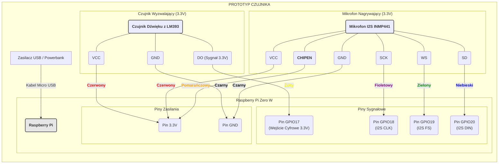

## 1. Lista co potrzebujemy

Z POZA LISTY:
- Nagrywanie próbek -> Moduł z mikrofonem MEMS INMP441: https://kamami.pl/moduly-z-mikrofonami-i-detektory-dzwieku/587534-modul-z-mikrofonem-mems-inmp441-5906623475483.html
- Wybudzanie -> Czujnik dźwięku z komparatorem LM393: https://nettigo.pl/products/czujnik-dzwieku-z-komparatorem-lm393

Z LISTY:
- Rassberry Pi Zero W
- Zasilacz
	
DODATKOWE:
- Obudowa (pomysł: Marta drukarka 3D)
- ew. Antena do karty sieciowej

## 2. Schemat (mermaid.live):

```
graph LR
    subgraph "PROTOTYP CZUJNIKA"

        %% Definicja głównej płytki - serca układu
        subgraph "Raspberry Pi Zero W"
            direction TB
            RPI("<b>Raspberry Pi</b>")
            
            subgraph "Piny Zasilania"
                Pin3V3("Pin 3.3V")
                PinGND("Pin GND")
            end

            subgraph "Piny Sygnałowe"
                PinGPIO17("Pin GPIO17<br>(Wejście Cyfrowe 3.3V)")
                PinGPIO18("Pin GPIO18<br>(I2S CLK)")
                PinGPIO19("Pin GPIO19<br>(I2S FS)")
                PinGPIO20("Pin GPIO20<br>(I2S DIN)")
            end
        end

        %% Definicja komponentów zewnętrznych
        subgraph "Czujnik Wyzwalający (3.3V)"
            MicDigital3V3("<b>Czujnik Dźwięku z LM393</b><br><i></i>")
            MicDigital3V3 --- VCC1("VCC") & GND1("GND") & DO("DO (Sygnał 3.3V)")
        end

        subgraph "Mikrofon Nagrywający (3.3V)"
            MicI2S("<b>Mikrofon I2S INMP441</b>")
            MicI2S --- VCC2("VCC") & GND2("GND") & SCK("SCK") & WS("WS") & SD("SD") & CHIPEN("<b>CHIPEN</b>")
        end
        
        Zasilacz["Zasilacz USB / Powerbank"] -- "Kabel Micro USB" --> RPI

        %% === POŁĄCZENIA (MAKSYMALNIE UPROSZCZONE) ===
        %% Zasilanie nowego czujnika dźwięku
        VCC1 -- "<b><font color=red>Czerwony" --> Pin3V3
        GND1 -- "<b><font color=black>Czarny" --> PinGND
        
        %% Bezpośrednie i bezpieczne połączenie sygnału
        DO -- "<b><font color=yellow>Żółty" --> PinGPIO17

        %% Połączenia mikrofonu I2S (pozostają bez zmian)
        VCC2 -- "<b><font color=red>Czerwony" --> Pin3V3
        GND2 -- "<b><font color=black>Czarny" --> PinGND
        SCK  -- "<b><font color=purple>Fioletowy" --> PinGPIO18
        WS   -- "<b><font color=green>Zielony" --> PinGPIO19
        SD   -- "<b><font color=blue>Niebieski" --> PinGPIO20
        CHIPEN -- "<b><font color=orange>Pomarańczowy" --> Pin3V3

    end

    %% Style dla czytelności
    style RPI fill:#e6e6e6,stroke:#333,stroke-width:2px
    style MicDigital3V3 fill:#lightblue,stroke:#333,stroke-width:2px
    style MicI2S fill:#lightgreen,stroke:#333,stroke-width:2px
```



