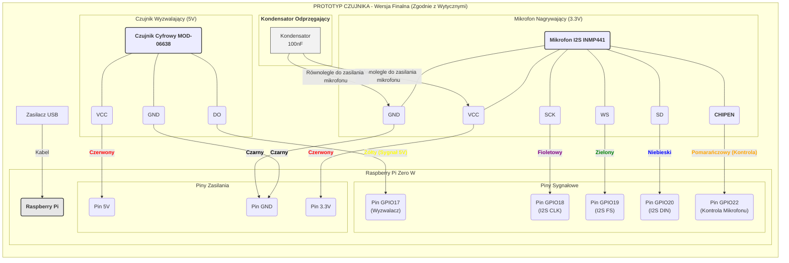

## 1. Lista co potrzebujemy

Z POZA LISTY:
- Nagrywanie próbek -> Moduł z mikrofonem MEMS INMP441: https://kamami.pl/moduly-z-mikrofonami-i-detektory-dzwieku/587534-modul-z-mikrofonem-mems-inmp441-5906623475483.html

Z LISTY:
- Rassberry Pi Zero W
- Zasilacz
- Wybudzanie -> Czujnik dźwięku MOD-06638
	
DODATKOWE:
- Obudowa (pomysł: Marta drukarka 3D)
- ew. Antena do karty sieciowej

## 2. Schemat (mermaid.live):

```
graph LR
    subgraph "PROTOTYP CZUJNIKA - Wersja Finalna (Zgodnie z Wytycznymi)"

        %% Definicja głównej płytki - serca układu
        subgraph "Raspberry Pi Zero W"
            direction TB
            RPI("<b>Raspberry Pi</b>")
            
            subgraph "Piny Zasilania"
                Pin5V("Pin 5V")
                Pin3V3("Pin 3.3V")
                PinGND("Pin GND")
            end

            subgraph "Piny Sygnałowe"
                PinGPIO17("Pin GPIO17<br>(Wyzwalacz)")
                PinGPIO22("Pin GPIO22<br>(Kontrola Mikrofonu)")
                PinGPIO18("Pin GPIO18<br>(I2S CLK)")
                PinGPIO19("Pin GPIO19<br>(I2S FS)")
                PinGPIO20("Pin GPIO20<br>(I2S DIN)")
            end
        end

        %% Definicja komponentów zewnętrznych
        subgraph "Czujnik Wyzwalający (5V)"
            MicDigital("<b>Czujnik Cyfrowy MOD-06638</b>")
            MicDigital --- VCC1("VCC") & GND1("GND") & DO("DO")
        end

        subgraph "Mikrofon Nagrywający (3.3V)"
            MicI2S("<b>Mikrofon I2S INMP441</b>")
            MicI2S --- VCC2("VCC") & GND2("GND") & SCK("SCK") & WS("WS") & SD("SD") & CHIPEN("<b>CHIPEN</b>")
        end
        
        subgraph "<b>Kondensator Odprzęgający</b>"
            Kondensator["Kondensator<br>100nF"]
        end
        
        Zasilacz["Zasilacz USB"] -- "Kabel" --> RPI

        %% === POŁĄCZENIA ===
        %% Zasilanie czujnika cyfrowego
        VCC1 -- "<b><font color=red>Czerwony" --> Pin5V
        GND1 -- "<b><font color=black>Czarny" --> PinGND
        
        %% Bezpośrednie połączenie sygnału z czujnika (zgodnie z zaleceniem)
        DO   -- "<b><font color=yellow>Żółty (Sygnał 5V)" --> PinGPIO17

        %% Połączenia mikrofonu I2S
        VCC2 -- "<b><font color=red>Czerwony" --> Pin3V3
        GND2 -- "<b><font color=black>Czarny" --> PinGND
        SCK  -- "<b><font color=purple>Fioletowy" --> PinGPIO18
        WS   -- "<b><font color=green>Zielony" --> PinGPIO19
        SD   -- "<b><font color=blue>Niebieski" --> PinGPIO20
        CHIPEN -- "<b><font color=orange>Pomarańczowy (Kontrola)" --> PinGPIO22

        %% Podłączenie kondensatora
        Kondensator -- "Równolegle do zasilania mikrofonu" --> VCC2
        Kondensator -- "Równolegle do zasilania mikrofonu" --> GND2
    end

    %% Style dla czytelności
    style RPI fill:#e6e6e6,stroke:#333,stroke-width:2px
    style MicDigital fill:#lightblue,stroke:#333,stroke-width:2px
    style MicI2S fill:#lightgreen,stroke:#333,stroke-width:2px
    style Kondensator fill:#f2f2f2,stroke:#333,stroke-width:1px
```



