# Dokumentacja Techniczna - Raspberry Pi Forest Monitoring System

## Spis treści

1. [Wprowadzenie](#wprowadzenie)
2. [Architektura systemu](#architektura-systemu)
3. [Implementacja komponentów](#implementacja-komponentów)
4. [Pipeline przetwarzania danych](#pipeline-przetwarzania-danych)
5. [Rozwiązania alternatywne](#rozwiązania-alternatywne)
6. [Konfiguracja i deployment](#konfiguracja-i-deployment)
7. [Źródła i referencje](#źródła-i-referencje)

---

## 1. Wprowadzenie

System monitoringu lasu oparty na Raspberry Pi to kompletne rozwiązanie IoT do wykrywania nielegalnego wycinania drzew poprzez analizę dźwięków piły mechanicznej. System integruje:
- Wykrywanie zdarzeń dźwiękowych (GPIO sensor)
- Nagrywanie audio z mikrofonu
- Analizę DSP (Digital Signal Processing)
- Weryfikację przez model ML (Machine Learning)
- Komunikację z backendem AWS

### Cel projektu
Stworzenie autonomicznego urządzenia, które może być zamontowane na drzewie i przez długi czas monitorować las, wysyłając alerty tylko wtedy, gdy zarówno analiza DSP jak i model ML potwierdzą wykrycie piły mechanicznej.

---

## 2. Architektura systemu

### 2.1. Diagram architektury


### 2.2. Komponenty systemu

| Komponent | Plik | Odpowiedzialność |
|-----------|------|------------------|
| Main Controller | `src/main.py` | Orkiestracja całego pipeline'u |
| Sound Sensor | `src/sound_sensor.py` | Wykrywanie zdarzeń dźwiękowych |
| Audio Recorder | `src/audio_recorder.py` | Nagrywanie audio z mikrofonu |
| Audio Processor | `src/audio_processor.py` | Analiza DSP (filtrowanie, FFT) |
| Chainsaw Detector | `src/chainsaw_detector.py` | Weryfikacja ML modelem TFLite |
| AWS Communicator | `src/aws_comunicator.py` | Komunikacja z backendem AWS |

---

## 3. Implementacja komponentów

### 3.1. Main Controller (`src/main.py`)

**Odpowiedzialność:** Główny orkiestrator systemu, integrujący wszystkie komponenty.

**Kluczowe klasy:**
- `ForestMonitoringSystem` - główna klasa systemu

**Implementacja:**

```python
# Inicjalizacja systemu z obsługą trybu mock
def __init__(self, config_path="config.json", mock_mode=False):
    self.mock_mode = mock_mode
    self.config = self._load_config(config_path)
    self._load_or_register_device()
    
    # Ładowanie modelu ML
    if ML_DETECTOR_AVAILABLE:
        self._load_ml_model()
```

**Referencje do kodu:**
- Linie 29-62: Inicjalizacja systemu i komponentów
- Linie 115-138: Metoda `_load_ml_model()` - ładowanie TensorFlow Lite
- Linie 140-250: Metoda `process_sound_event()` - główny pipeline

**Kluczowe decyzje projektowe:**
1. **Tryb mock** - możliwość testowania bez sprzętu (linie 47-50)
2. **Lazy loading ML** - model ładowany tylko jeśli TensorFlow dostępny (linie 20-26)
3. **Fallback strategy** - system działa nawet bez modelu ML (linia 125)

**Źródła:**
- [Python sys.path manipulation](https://docs.python.org/3/library/sys.html#sys.path) - dynamiczne dodawanie ścieżek
- [Context managers in Python](https://docs.python.org/3/reference/datamodel.html#context-managers) - obsługa cleanup

---

### 3.2. Sound Sensor (`src/sound_sensor.py`)

**Odpowiedzialność:** Wykrywanie zdarzeń dźwiękowych poprzez GPIO pin.

**Implementacja kluczowych metod:**

```python
class SoundSensor:
    def __init__(self, pin=17):
        """Inicjalizacja GPIO pin 17 jako wejście"""
        GPIO.setmode(GPIO.BCM)
        GPIO.setup(pin, GPIO.IN)
    
    def wait_for_sound(self, timeout=1.0):
        """Czekaj na HIGH signal na pinie"""
        return GPIO.input(self.pin) == GPIO.HIGH
```

**Mock implementation:**

```python
class MockSoundSensor(SoundSensor):
    """Symulator sensora dla testów bez hardware"""
    def wait_for_sound(self, timeout=1.0):
        time.sleep(random.uniform(3, 8))
        return True
```

**Referencje do kodu:**
- Linie 9-45: Implementacja `SoundSensor` z RPi.GPIO
- Linie 48-80: Implementacja `MockSoundSensor` dla testów

**Rozwiązania alternatywne (rozważane):**
1. ~~Ciągłe próbkowanie audio~~ - zbyt duże zużycie energii
2. ~~Interrupt-based detection~~ - RPi.GPIO nie wspiera edge detection stabilnie
3. ✅ **Polling z timeout** - prosty i niezawodny

**Źródła:**
- [RPi.GPIO Documentation](https://sourceforge.net/p/raspberry-gpio-python/wiki/Home/)
- [GPIO Pin Layout](https://pinout.xyz/)

---

### 3.3. Audio Recorder (`src/audio_recorder.py`)

**Odpowiedzialność:** Nagrywanie audio z mikrofonu lub ładowanie plików testowych.

**Implementacja:**

```python
class AudioRecorder:
    def record(self, duration_seconds=10):
        """Nagrywa audio przez sounddevice"""
        with sd.InputStream(
            samplerate=self.sample_rate,
            channels=self.channels,
            dtype=self.dtype,
            callback=self.audio_callback,
            device=self.device
        ):
            sd.sleep(duration_seconds * 1000)
```

**Kluczowe decyzje:**
1. **Lazy import sounddevice** (linie 7-10) - pozwala na uruchomienie mock bez instalacji
2. **Callback-based recording** (linie 27-30) - streaming audio bez blokowania
3. **WAV format** - bezstratny, kompatybilny z DSP i ML

**Referencje do kodu:**
- Linie 14-101: Klasa `AudioRecorder` z obsługą mikrofonu
- Linie 104-165: Klasa `MockAudioRecorder` dla testów

**Parametry audio:**
- Sample rate: 48000 Hz (standardowy dla audio profesjonalnego)
- Channels: 2 (stereo dla lepszej lokalizacji)
- Dtype: int32 (wysoka precyzja)

**Źródła:**
- [sounddevice library](https://python-sounddevice.readthedocs.io/)
- [wavio - WAV file I/O](https://github.com/WarrenWeckesser/wavio)
- [PortAudio documentation](http://www.portaudio.com/docs/v19-doxydocs/)

---

### 3.4. Audio Processor (`src/audio_processor.py`)

**Odpowiedzialność:** Analiza DSP - filtrowanie pasmowe i wykrywanie piły mechanicznej.

**Pipeline DSP:**

```python
def analyze_audio(audio_path, lowcut=500, highcut=8000):
    # 1. Wczytanie audio
    data, sr = librosa.load(audio_path)
    
    # 2. Filtr pasmowy (500-8000 Hz - zakres piły)
    data_filtered = bandpass_filter(data, lowcut, highcut, sr)
    
    # 3. FFT (Fast Fourier Transform)
    data_fft = np.fft.fft(data_filtered)
    freqs = np.fft.fftfreq(len(data_filtered), 1/sr)
    
    # 4. Analiza częstotliwości szczytowych
    peak_idx = np.argmax(positive_fft)
    peak_freq = positive_freqs[peak_idx]
    
    # 5. Obliczenie średniej energii
    avg_energy = np.mean(positive_fft)
```

**Filtr Butterwortha:**

```python
def bandpass_filter(data, lowcut, highcut, fs, order=4):
    """Filtr pasmowy 4. rzędu"""
    sos = butter(order, [lowcut, highcut], btype='band', 
                 fs=fs, output='sos')
    filtered = sosfilt(sos, data)
    return filtered
```

**Referencje do kodu:**
- Linie 6-13: Import z fallbackiem dla numba
- Linie 16-25: Implementacja `bandpass_filter()`
- Linie 28-68: Funkcja `analyze_audio()` - główna analiza DSP
- Linie 71-80: Funkcja `is_chainsaw_detected()` - prosta heurystyka

**Parametry DSP:**
- Lowcut: 500 Hz (dolna częstotliwość piły)
- Highcut: 8000 Hz (górna częstotliwość piły)
- Order: 4 (rząd filtru Butterwortha)
- Threshold: 1000 (prog energii dla wykrycia)

**Rozważane rozwiązania:**
1. ~~Mel-frequency cepstral coefficients (MFCC)~~ - zbyt skomplikowane dla Raspberry Pi
2. ~~Wavelet transform~~ - wysokie wymagania obliczeniowe
3. **FFT + bandpass** - szybkie, skuteczne, sprawdzone

**Źródła:**
- [librosa documentation](https://librosa.org/doc/latest/index.html)
- [scipy.signal filtering](https://docs.scipy.org/doc/scipy/reference/signal.html)
- [Butterworth filter design](https://en.wikipedia.org/wiki/Butterworth_filter)
- [Understanding FFT](https://www.nti-audio.com/en/support/know-how/fast-fourier-transform-fft)

---

### 3.5. Chainsaw Detector (`src/chainsaw_detector.py`)

**Odpowiedzialność:** Weryfikacja wykrycia piły mechanicznej przez model ML (TensorFlow Lite).

**Pipeline ML:**

```python
def preprocess_audio(file_path):
    # 1. Wczytanie i resampling do 22050 Hz
    y, sr = librosa.load(file_path, sr=SAMPLE_RATE, duration=None)
    
    # 2. Standaryzacja długości do 3 sekund
    if len(y) < SAMPLES_PER_TRACK:
        y = librosa.util.fix_length(y, size=int(SAMPLES_PER_TRACK))
    else:
        y = y[:int(SAMPLES_PER_TRACK)]
    
    # 3. Mel-spektrogram (128 mel bands, fmax=8000 Hz)
    mels = librosa.feature.melspectrogram(
        y=y, sr=sr, n_mels=IMG_SIZE[0], fmax=8000
    )
    mels_db = librosa.power_to_db(mels, ref=np.max)
    
    # 4. Resize do 128x128
    img = cv2.resize(mels_db, (IMG_SIZE[1], IMG_SIZE[0]))
    
    # 5. Normalizacja (0-1)
    img = (img + 80) / 80.0
    img = np.clip(img, 0, 1)
    
    # 6. Konwersja do RGB (dla modelu CNN)
    img = np.stack((img,)*3, axis=-1)
    
    # 7. Batch dimension + float32
    img = np.expand_dims(img, axis=0).astype(np.float32)
    
    return img
```

**Inference:**

```python
def run_inference(interpreter, input_details, output_details, audio_path):
    # Preprocessing
    input_data = preprocess_audio(audio_path)
    
    # Set input tensor
    interpreter.set_tensor(input_details[0]['index'], input_data)
    
    # Run inference
    interpreter.invoke()
    
    # Get output (probability 0.0 - 1.0)
    output_data = interpreter.get_tensor(output_details[0]['index'])
    prediction_score = output_data[0][0]
    
    return prediction_score
```

**Referencje do kodu:**
- Linie 1-18: Konfiguracja modelu (ścieżki, parametry)
- Linie 20-66: Funkcja `preprocess_audio()` - transformacja do mel-spektrogramu
- Linie 68-89: Funkcja `run_inference()` - wywołanie TFLite

**Parametry ML:**
- Input: 128x128x3 RGB mel-spektrogram
- Sample rate: 22050 Hz
- Duration: 3 sekundy (66150 próbek)
- Model: TensorFlow Lite (zoptymalizowany dla ARM)
- Threshold: 0.5 (50% pewności)

**Integracja z pipeline:**

W `main.py` (linie 197-227):
```python
if is_chainsaw_dsp and self.ml_interpreter is not None:
    ml_score = run_inference(
        self.ml_interpreter,
        self.ml_input_details,
        self.ml_output_details,
        audio_path
    )
    
    is_chainsaw_ml = ml_score > self.config.get('ml_threshold', 0.5)
```

**Rozważane rozwiązania:**
1. ~~Full TensorFlow model~~ - zbyt duży rozmiar (>50MB)
2. ~~Edge TPU (Coral)~~ - dodatkowy sprzęt, koszt
3. ✅ **TensorFlow Lite** - zoptymalizowany dla ARM, mały rozmiar (<5MB)
4. ~~ONNX Runtime~~ - gorsze wsparcie dla Raspberry Pi

**Źródła:**
- [TensorFlow Lite](https://www.tensorflow.org/lite)
- [Mel-spectrogram explanation](https://medium.com/analytics-vidhya/understanding-the-mel-spectrogram-fca2afa2ce53)
- [CNN for audio classification](https://towardsdatascience.com/audio-deep-learning-made-simple-sound-classification-step-by-step-cebc936bbe5)
- [librosa mel-spectrogram](https://librosa.org/doc/main/generated/librosa.feature.melspectrogram.html)

---

### 3.6. AWS Communicator (`src/aws_comunicator.py`)

**Odpowiedzialność:** Komunikacja z backendem AWS - rejestracja urządzenia i wysyłanie alertów.

**Rejestracja urządzenia:**

```python
def register_device(latitude, longitude):
    """Rejestruje urządzenie w AWS i zapisuje device_id lokalnie"""
    url = f"{BASE_URL}/register"
    payload = {
        "latitude": latitude,
        "longitude": longitude,
        "timestamp": datetime.now().isoformat()
    }
    
    response = requests.post(url, json=payload, timeout=10)
    
    if response.status_code == 200:
        data = response.json()
        device_id = data.get('deviceId')
        device_secret = data.get('deviceSecret')
        
        # Zapisz lokalnie
        save_device_identity(device_id, device_secret)
        
        return device_id, device_secret
```

**Wysyłanie alertu:**

```python
def send_alert(device_id, latitude, longitude, audio_file_path):
    """Wysyła alert z plikiem audio zakodowanym base64"""
    url = f"{BASE_URL}/alert"
    
    # Kodowanie audio do base64
    with open(audio_file_path, 'rb') as f:
        audio_bytes = f.read()
        audio_base64 = base64.b64encode(audio_bytes).decode('utf-8')
    
    payload = {
        "deviceId": device_id,
        "latitude": latitude,
        "longitude": longitude,
        "timestamp": datetime.now().isoformat(),
        "audioData": audio_base64,
        "audioFormat": "wav"
    }
    
    response = requests.post(url, json=payload, timeout=30)
    return response.status_code == 200
```

**Referencje do kodu:**
- Linie 9-10: BASE_URL (endpoint AWS API Gateway)
- Linie 12-57: Funkcja `register_device()` z persystencją
- Linie 59-94: Funkcja `send_alert()` z base64 encoding
- Linie 96-110: Funkcje pomocnicze (save/load device identity)

**Format komunikacji:**
- Protokół: HTTP/HTTPS REST
- Format: JSON
- Audio encoding: Base64 (dla binary data w JSON)
- Timeout: 30s (upload może trwać dłużej)

**Persystencja identyfikacji:**
```json
// device_identity.json
{
  "deviceId": "uuid-v4",
  "deviceSecret": "token",
  "registeredAt": "2025-12-02T22:04:43Z"
}
```

**Źródła:**
- [requests library](https://requests.readthedocs.io/)
- [Base64 encoding](https://docs.python.org/3/library/base64.html)
- [REST API best practices](https://restfulapi.net/)

---

## 4. Pipeline przetwarzania danych

### 4.1. Szczegółowy flow

```mermaid
flowchart TD
    START(["START"]) --> GPIO["1️⃣ GPIO Sensor Detection<br/>sound_sensor.py<br/>wait_for_sound()"]
    GPIO --> REC["2️⃣ Audio Recording<br/>audio_recorder.py<br/>record_and_save() → WAV 10s, 48kHz"]
    REC --> DSP["3️⃣ DSP Analysis<br/>audio_processor.py<br/>bandpass_filter(500-8000 Hz)<br/>FFT transform<br/>is_chainsaw_detected()"]
    
    DSP --> DSP_CHECK{"DSP wykryło piłę?"}
    DSP_CHECK -->|TAK| ML["4️⃣ ML Verification<br/>chainsaw_detector.py<br/>preprocess_audio() → mel-spectrogram<br/>run_inference() → TFLite"]
    DSP_CHECK -->|NIE| SKIP["Pomiń ML"]
    
    ML --> ML_CHECK{"ML potwierdza?<br/>score > 0.5"}
    ML_CHECK -->|TAK| DECISION["5️⃣ Decision Logic<br/>Alert = DSP ∧ ML"]
    ML_CHECK -->|NIE| NO_ALERT["❌ Fałszywy alarm"]
    SKIP --> NO_ALERT
    
    DECISION --> AWS["6️⃣ AWS Communication<br/>aws_comunicator.py<br/>send_alert() → base64 + metadata"]
    AWS --> DONE["✅ Alert wysłany"]
    
    NO_ALERT --> LOOP
    DONE --> LOOP
    LOOP(["🔄 LOOP"]) --> GPIO
    
    style START fill:#c8e6c9,stroke:#2e7d32
    style DONE fill:#c8e6c9,stroke:#2e7d32
    style NO_ALERT fill:#ffcdd2,stroke:#c62828
    style DSP_CHECK fill:#fff9c4,stroke:#f9a825
    style ML_CHECK fill:#fff9c4,stroke:#f9a825
```



### 4.2. Przykładowy scenariusz wykonania

**Scenariusz 1: Piła mechaniczna wykryta**

```
[Time: 14:23:15]
════════════════════════════════════════════════════════════
SOUND EVENT DETECTED - 2025-12-12 14:23:15
════════════════════════════════════════════════════════════

[1/4] Recording audio...
Recording for 10 seconds...
Captured 480000 samples
Recording complete. Captured 480000 samples.
Audio saved to: recordings/recording_20251212_142315.wav

[2/4] Analyzing audio...
  Duration: 10.00s
  Peak frequency: 3521.45 Hz
  Average energy: 1523.67
  ⚠️  DSP: CHAINSAW DETECTED!

[3/4] 🤖 ML Model verification...
  ML confidence: 87.34%
  ✅ ML CONFIRMED: Chainsaw detected (threshold: 50%)

[4/4] 🚨 Chainsaw CONFIRMED! Sending alert to AWS...
     ✅ Alert sent successfully!
════════════════════════════════════════════════════════════
```

**Scenariusz 2: Fałszywy alarm (DSP wykryło, ML odrzuciło)**

```
[Time: 14:25:42]
════════════════════════════════════════════════════════════
SOUND EVENT DETECTED - 2025-12-12 14:25:42
════════════════════════════════════════════════════════════

[1/4] Recording audio...
Recording for 10 seconds...
Audio saved to: recordings/recording_20251212_142542.wav

[2/4] Analyzing audio...
  Duration: 10.00s
  Peak frequency: 4102.31 Hz
  Average energy: 1156.23
  ⚠️  DSP: CHAINSAW DETECTED!

[3/4] 🤖 ML Model verification...
  ML confidence: 32.12%
  ❌ ML REJECTED: Not a chainsaw (threshold: 50%)

[4/4] ℹ️  DSP detected but ML rejected - alert NOT sent
     Continuing monitoring...
════════════════════════════════════════════════════════════
```

---

## 5. Rozwiązania alternatywne

### 5.1. Wykrywanie zdarzeń dźwiękowych

#### Rozważane opcje:

**1. Ciągłe próbkowanie audio (RMS threshold)**
- ❌ Odrzucone z powodu:
  - Wysokie zużycie energii (mikrofon zawsze aktywny)
  - Wysokie zużycie CPU (ciągła analiza)
  - Krótki czas życia baterii

**2. Interrupt-based detection (GPIO edge detection)**
- ❌ Odrzucone z powodu:
  - RPi.GPIO ma problemy z edge detection (false positives)
  - Brak sprzętowego filtru odbicia (debouncing)
  - Niestabilne na Raspberry Pi

**3. Polling z timeout (wybrane rozwiązanie)**
- ✅ Zalety:
  - Prosty w implementacji
  - Niezawodny
  - Niskie zużycie CPU między detekcjami
  - Łatwy w debugowaniu

### 5.2. Model ML

#### Rozważane frameworki:

**1. PyTorch Mobile**
- ❌ Odrzucone:
  - Gorsze wsparcie dla ARM
  - Większe modele
  - Wolniejszy inference

**2. ONNX Runtime**
- ⚠️ Rozważane:
  - Cross-platform
  - ❌ Gorsze wsparcie dla Raspberry Pi
  - Problemy z instalacją na ARM

**3. TensorFlow Lite (wybrane)**
- ✅ Zalety:
  - Najlepsze wsparcie dla ARM
  - Małe modele (<5MB)
  - Szybki inference
  - Dobre narzędzia (model converter)

**4. Edge TPU (Coral)**
- ⚠️ Rozważane w przyszłości:
  - Bardzo szybki inference (<10ms)
  - ❌ Dodatkowy koszt sprzętu (~$30)
  - ❌ Wymaga specjalnego modelu

### 5.3. Strategia detekcji

#### Rozważane podejścia:

**1. Tylko DSP (threshold-based)**
- ⚠️ Pierwotne rozwiązanie:
  - Prosty
  - Szybki
  - ❌ Dużo false positives (ptaki, wiatr)

**2. Tylko ML**
- ❌ Odrzucone:
  - Wolny (5-7s inference)
  - Wymaga dużo CPU
  - ❌ Bez pre-filteringu wszystkie dźwięki byłyby analizowane

**3. DSP + ML (two-stage) - wybrane**
- ✅ Zalety:
  - DSP jako szybki pre-filter
  - ML jako weryfikacja (redukuje false positives)
  - Najlepsza równowaga: szybkość vs dokładność
  - Energia oszczędzana (ML tylko gdy DSP wykryje)

**4. Ensemble (multiple ML models)**
- ⚠️ Rozważane w przyszłości:
  - Większa dokładność
  - ❌ Znacznie wolniejszy
  - ❌ Większe zużycie zasobów

---

## 6. Konfiguracja i deployment

### 6.1. Plik konfiguracyjny (`config.json`)

```json
{
  "latitude": 52.2297,           // Lokalizacja GPS
  "longitude": 21.0122,
  "sensor_pin": 17,               // GPIO pin dla sensora
  "sample_rate": 48000,           // Sample rate audio (Hz)
  "channels": 2,                  // Kanały audio (stereo)
  "recording_duration": 10,       // Długość nagrania (s)
  "recordings_dir": "recordings", // Folder na nagrania
  "audio_device": null,           // Device ID (null = default)
  "chainsaw_threshold": 1000,     // Próg energii DSP
  "bandpass_low": 500,            // Dolna częst. filtru (Hz)
  "bandpass_high": 8000,          // Górna częst. filtru (Hz)
  "ml_model_path": "chainsaw_model.tflite",  // Ścieżka do modelu
  "ml_threshold": 0.5             // Próg pewności ML (0-1)
}
```

### 6.2. Instalacja środowiska Python

**Opcja 1: Virtual environment (zalecane)**
```bash
cd ~/sound-based-forest-monitoring/rasberry_software
python3 -m venv venv
source venv/bin/activate

pip install --upgrade pip
pip install -r requirements.txt
```

### 6.3. Uruchomienie systemu

**Tryb normalny (z hardware):**
```bash
python src/main.py
```

**Tryb mock (testy bez sprzętu):**
```bash
python src/main.py --mock
```

---

## 7. Źródła i referencje

### 7.1. Dokumentacje oficjalne

**Python Libraries:**
- [Python 3.11 Documentation](https://docs.python.org/3.11/)
- [NumPy User Guide](https://numpy.org/doc/stable/user/index.html)
- [SciPy Documentation](https://docs.scipy.org/doc/scipy/)
- [librosa Documentation](https://librosa.org/doc/latest/index.html)
- [TensorFlow Lite Guide](https://www.tensorflow.org/lite/guide)
- [OpenCV Python](https://docs.opencv.org/4.x/d6/d00/tutorial_py_root.html)
- [requests Library](https://requests.readthedocs.io/)
- [sounddevice Documentation](https://python-sounddevice.readthedocs.io/)

**Hardware:**
- [Raspberry Pi Documentation](https://www.raspberrypi.com/documentation/)
- [RPi.GPIO Wiki](https://sourceforge.net/p/raspberry-gpio-python/wiki/Home/)
- [GPIO Pinout Reference](https://pinout.xyz/)
- [PortAudio Documentation](http://www.portaudio.com/docs/v19-doxydocs/)

### 7.2. Artykuły i tutoriale

**Digital Signal Processing:**
- [Understanding the FFT](https://www.nti-audio.com/en/support/know-how/fast-fourier-transform-fft)
- [Butterworth Filter Design](https://en.wikipedia.org/wiki/Butterworth_filter)
- [Bandpass Filter Explained](https://www.electronics-tutorials.ws/filter/filter_3.html)

**Machine Learning:**
- [Audio Classification with CNN](https://towardsdatascience.com/audio-deep-learning-made-simple-sound-classification-step-by-step-cebc936bbe5)
- [Understanding Mel-Spectrograms](https://medium.com/analytics-vidhya/understanding-the-mel-spectrogram-fca2afa2ce53)
- [TensorFlow Lite on Raspberry Pi](https://www.tensorflow.org/lite/guide/python)
- [Audio Feature Extraction](https://librosa.org/doc/main/feature.html)

**REST API Design:**
- [REST API Best Practices](https://restfulapi.net/)
- [HTTP Status Codes](https://developer.mozilla.org/en-US/docs/Web/HTTP/Status)
- [Base64 Encoding](https://developer.mozilla.org/en-US/docs/Glossary/Base64)

**IoT & Deployment:**
- [Systemd Service Units](https://www.freedesktop.org/software/systemd/man/systemd.service.html)
- [Python Virtual Environments](https://docs.python.org/3/tutorial/venv.html)
- [Raspberry Pi Deployment Guide](https://www.raspberrypi.com/documentation/computers/getting-started.html)

### 7.3. Narzędzia używane w projekcie

- **Visual Studio Code** - IDE
- **Git** - version control
- **curl** - testing HTTP endpoints
- **Postman** - API testing
- **htop** - system monitoring
- **Audacity** - audio analysis and debugging

### 7.4. Repozytorium i zasoby

- Repozytorium projektu: `maciej-klimek/sound-based-forest-monitoring`
- Model ML: `chainsaw_model.tflite`
- Pliki testowe: `tests/test_file/sample.wav`

---

## 8. Rozwiązane problemy i wnioski

### 8.1. Napotkane problemy

**Problem 1: False positives w DSP**
- Symptom: Wiatr, ptaki triggerują alerty
- Przyczyna: Prosta heurystyka threshold-based
- Rozwiązanie: Two-stage detection (DSP + ML verification)

**Problem 2: Długi czas inference**
- Symptom: ML trwa 5-7s na RPi
- Przyczyna: Pełny model TensorFlow był zbyt ciężki
- Rozwiązanie: Konwersja do TensorFlow Lite (optymalizacja dla ARM)

---

## Podsumowanie

System monitoringu lasu oparty na Raspberry Pi to kompletne rozwiązanie IoT łączące:
- **Hardware**: GPIO sensors, mikrofony USB, Raspberry Pi
- **DSP**: Filtrowanie pasmowe, FFT, analiza częstotliwości
- **ML**: TensorFlow Lite, CNN, mel-spektrogramy
- **Cloud**: AWS REST API, komunikacja JSON+base64
- **Software Engineering**: Mock testing, modular architecture, error handling

Kluczowe innowacje:
1. **Two-stage detection** (DSP + ML) - eliminuje false positives
2. **Lazy loading** - system działa nawet bez TensorFlow
3. **Mock mode** - testy bez hardware
4. **Fallback strategy** - graceful degradation

System jest gotowy do deploymentu i testów w realnych warunkach leśnych.
